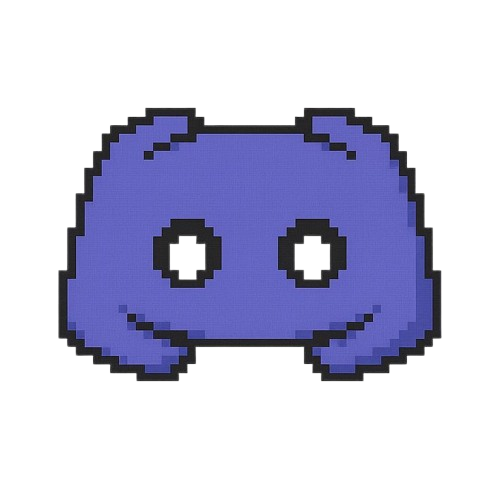

<picture>
  <source media="(prefers-color-scheme: dark)" srcset="https://capsule-render.vercel.app/api?type=rect&color=FFFFFF&height=160&section=header&text=Hi%2C%20I'm%20Rudy%20%F0%9F%91%8B&fontSize=50&fontColor=000000&fontAlignY=50&desc=Linux%20System%20Administrator%20·%20Game%20Dev%20·%20Powerlifter&descSize=16&descAlignY=78&descColor=000000">
  
</picture>

<picture>
  <source media="(prefers-color-scheme: dark)" srcset="https://capsule-render.vercel.app/api?type=rect&color=FFFFFF&height=2&width=100">
  
</picture>

### ***What I Do***

<table>
<tr>
<td width="65%">

Trained in systems engineering at **CESI**, I currently work in **Linux system administration** — deploying and maintaining reliable, high-performance environments.

Passionate about IT for a long time, I keep expanding my skills through personal projects. More details in my **Resume** page.

</td>
<td width="35%" align="center">

<picture>
  <source media="(prefers-color-scheme: dark)" srcset="https://skillicons.dev/icons?i=linux%2Cdebian%2Cdocker%2Ckubernetes%2Cansible%2Cgitlab%2Cgithub%2Cgit%2Cbash%2Cpython%2Cmysql%2Cpostgres%2Cmongodb%2Cgrafana%2Cprometheus%2Cobsidian%2Ccloudflare&perline=5&theme=light">
  
</picture>

</td>
</tr>
</table>

<picture>
  <source media="(prefers-color-scheme: dark)" srcset="https://capsule-render.vercel.app/api?type=rect&color=FFFFFF&height=2&width=100">
  
</picture>

### ***Hobbies & Goals***

<table>
<tr>
<td width="35%">

</td>
<td width="65%">

**🎮 Game dev**

I'm also passionate about **game dev**, which I explore in my free time through various projects — modding, prototypes, experiments across different engines. It's the perfect playground to combine creativity and technical skill.

<picture>
  <source media="(prefers-color-scheme: dark)" srcset="https://img.shields.io/badge/-Minecraft%20Modding-FFFFFF?style=for-the-badge&logo=minecraft&logoColor=000000">
  
</picture>
<picture>
  <source media="(prefers-color-scheme: dark)" srcset="https://img.shields.io/badge/-Unreal%20Engine-FFFFFF?style=for-the-badge&logo=unrealengine&logoColor=000000">
  
</picture>
<picture>
  <source media="(prefers-color-scheme: dark)" srcset="https://img.shields.io/badge/-Godot-FFFFFF?style=for-the-badge&logo=godotengine&logoColor=000000">
  
</picture>

 

**🏋️ Powerlifting**

I've been competing in **powerlifting** (squat, bench, deadlift) for over a year now.

</td>
</tr>
</table>

<picture>
  <source media="(prefers-color-scheme: dark)" srcset="https://capsule-render.vercel.app/api?type=rect&color=FFFFFF&height=2&width=100">
  
</picture>

### ***Community***

<table>
<tr>
<td width="65%">

I run a small Discord community where I share my projects, commits, and game servers I develop and manage.

<a href="https://discord.gg/6ffyCYq3Ea">
<picture>
  <source media="(prefers-color-scheme: dark)" srcset="https://img.shields.io/badge/-Join%20the%20Discord-FFFFFF?style=for-the-badge&logo=discord&logoColor=000000">
  
</picture>
</a>

Have a project, an idea, or just want to chat? Feel free to reach out — I'm always up for learning and sharing.

</td>
<td width="35%" align="center">

</td>
</tr>
</table>

<picture>
  <source media="(prefers-color-scheme: dark)" srcset="https://capsule-render.vercel.app/api?type=rect&color=FFFFFF&height=2&width=100">
  
</picture>

Thanks for stopping by my profile ✌️

