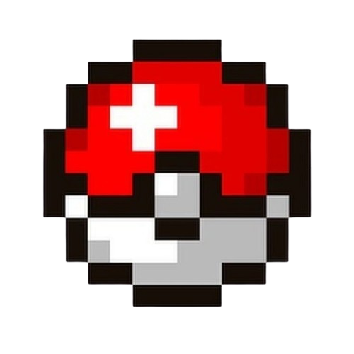

# Salut, moi c'est Rudy 👋

###  ***Ce que je fais***

<table>
<tr>
<td width="65%">

Formé en ingénierie système au **CESI**, je travaille aujourd'hui dans l'**administration système Linux** — déploiement et maintenance d'environnements fiables et performants.

Passionné d'informatique depuis longtemps, je continue à explorer de nouvelles compétences à travers des projets personnels. Plus de détails dans ma page **CV**.

</td>
<td width="35%" align="center">

 

 

 

</td>
</tr>
</table>

###  ***Hobbies & Goals***

**🎮 Game dev**

Je suis aussi passionné de **game dev**, que j'explore sur mon temps libre à travers différents projets — moddings, prototypes, expérimentations sur divers moteurs. C'est un terrain de jeu parfait pour allier créativité et technique.

 

**🏋️ Force athlétique**

Je pratique la **force athlétique** (squat, bench, deadlift) en compétition depuis plus d'un an.

###  ***Communauté***

J'anime une petite communauté Discord autour de mes projets et de serveurs de jeux que je développe et administre.

Un projet, une idée, ou juste envie d'échanger — n'hésitez pas à me contacter.

Merci d'être passé sur mon profil ✌️

